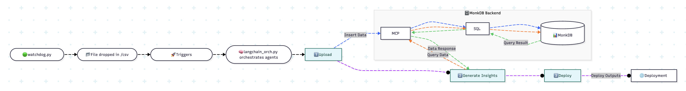

# 🧠 Agentic AI in Retail, Powered by MonkDB

Monk-RET (**Monk Retail Insights Engine**) is an intelligent retail analytics platform powered by **MonkDB**, **MonkDB's MCP** **LangChain**, **Streamlit**, and modern AI/ML pipelines.  
It helps businesses gain actionable insights from large-scale retail data by orchestrating data ingestion, processing, and visualization seamlessly.  

---

## ✨ Features  

- 📊 **Retail Analytics Engine** – Ingests and processes large-scale retail datasets into MonkDB.
- 🧩 **LangChain Orchestrator** – Modular orchestration of tasks with LLMs  
- ⚡ **Batch Data Processing** – Automated CSV ingestion & database syncing  
- 📈 **Interactive Dashboards** – Streamlit-based UI for analytics & insights  
- 🔄 **Automation** – Watchdog-powered auto-refresh for new datasets  

---

## 🚀 Getting Started  

### 1️⃣ Clone the repo
```bash
git clone https://github.com/monkdbofficial/demo.retailagent.git
cd demo.retailagent
```

### 2️⃣ Install dependencies
```bash
pip install -r requirements.txt
```

### 3️⃣ Run the Watchdong 
```bash
python watchdog_.py
```

### 4️⃣ Move `_sample_products.csv` to `csv_folder/`
This shall trigger the watch and downstream agent orchestration logic which do the following in phases:

- Chunk the data to 5000 records, and leverage dask to process the records before publishing to MonkDB tables.
- Generate a streamlit dashboard app with insights based on MonkDB's sql queries. 
- The streamlit dashboard is deployed to its destination that has the dashboard, charts, and metrics in those charts.

---

## Data Flow



As highlighted in the data flow diagram, watchdog triggers agents execution. 

- **Upload agent**- It uploads the processed data to MonkDB.
- **Generate Insights agent**- It generates the insights by querying the database using MonkDB's SQL via MCP in agent's tool interface. It is used to generate the dashboard pack.
- **Deploy agent**- This agent deploys the pack to destination. 

--- 

## 🛠️ Tech Stack  

- **Languages:** Python  
- **Database:** MonkDB and its python sdk
- **Frameworks:** MonkDB's MCP, LangChain
- **Data:** Dask  
- **DevOps:** Watchdog  
- **Visualization:** Plotly, Streamlit  

---

## Demo

[](https://www.youtube.com/watch?v=heITkFnI1Ho)

---

## Pre-requisites

- Install and provision MonkDB as per its [documentation](https://github.com/monkdbofficial/monk-documentation/tree/main/documentation). 

- Provision MonkDB's user using PSQL as highlighted in MonkDB's [documentation](https://github.com/monkdbofficial/monk-documentation/tree/main/documentation). 

- In this repo, update [config.ini](./config/config.ini) file located in config folder. Please ensure the IP address of `DB_HOST` variable is updated. It denotes the instance where MonkDB is installed. 

- Provision an LLM model. We are using Mistral via Ollama (`ollama run mistral`).

```text
[database]
DB_HOST = xx.xx.xx.xxx
DB_PORT = 4200
DB_USER = testuser
DB_PASSWORD = testpassword
DB_SCHEMA = trent
TABLE_NAME = products
```

- Also, ensure `.env` is updated in the root of this repo with the correct IP address of MonkDB's host.

```text
MONKDB_HOST=xx.xx.xx.xxx
MONKDB_PORT=4200
MONKDB_USER=testuser
MONKDB_PASSWORD=testpassword
MONKDB_SCHEMA=trent
MONKDB_API_PORT=4200

# Optional OTEL configuration which can be enabled or disabled.
MONKDB_OTEL_ENABLED=false
```

- As highlighted before, please create a virtual env and activate it before install requirements using pip. 

---

## 📊 Example Workflow  

1. Drop a new retail CSV into the `/csv_folder` folder  
2. `watchdog_.py` detects and inserts data → DB  
3. `langchain_orch.py` & `gen_insights_force.py` generate AI-powered insights  
4. Open `streamlit_app.py` → interactive analytics dashboard  

---

## Performance Benchmark Test

Run this below command to execute performance testing.

```sh
python3 monkdb_pipeline_testrunner.py --csv datasets/_sample_products.csv --table trent.products --where "1=1" --parity-sample 200 --perf-repeats 20 --out-json reports/report.json --out-md reports/report.md
```

This will execute our pipeline testrunner test script, and generate reports in reports folder.

We have executed performance tests in the below instance (digital ocean)

- **OS**: Ubuntu 25.04 x64
- **vCPUs**: 4 vCPUs
- **RAM/SSD**: 8GB / 240GB Disk
- **Family**: General compute

### Note

Due to cost considerations, testing was conducted on a modest DigitalOcean droplet (4 vCPU / 8 GB RAM / 240 GB SSD). Consequently, the KPI, discount-band, and brand-share queries measured around 0.8–1.1 s P95.

In production we recommend AWS m6in (or equivalent) instances. These are powered by 3rd-Gen Intel Xeon Scalable (“Ice Lake”) CPUs up to 3.5 GHz, with 200 Gbps networking and 80–100 Gbps EBS throughput, and scale to 128 vCPUs / 512 GiB RAM. Our enterprise MonkDB customers running similar analytics consistently achieve sub-300 ms P95 latencies on such hardware.

This means the latencies observed on DigitalOcean should be viewed as conservative; significantly lower numbers are expected on production-grade instances.


---

## Notes

You may swap 

- langchain with another agentic framework.
- Streamlit with another frontend framework.
- Mistral model with another LLM model which is a pre-requisite for agentic framework.

--- 

## License

This repo is licensed under permissive **Apache 2.0** license.
